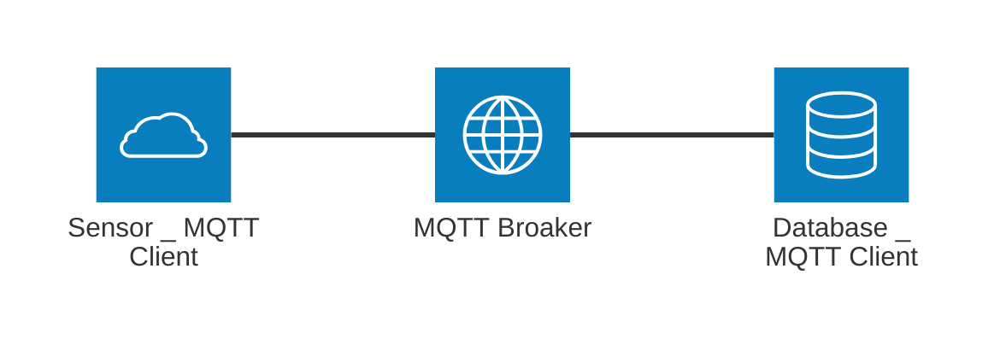

# System Architeture

```mermaid
architecture-beta

    service sensor(cloud)[Sensor _ MQTT Client] 
    service broaker(internet)[MQTT Broaker] 
    service db(database)[Database _ MQTT Client]

    sensor:R -- L:broaker
    broaker:R -- L:db
```